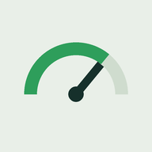

# Vida productiva

Tablero personal de hábitos. Anotas en qué se te fue el día, el manómetro sube y
la app te dice cuántas horas te sobraron.



La app está en **https://machadoapp.github.io/vida-productiva/**

## Probarlo en el computador

```bash
node servidor.js
```

Abre `http://localhost:8000`. Hace falta el servidor: abriendo el archivo con
doble clic, Chrome bloquea el guardado y la app no recuerda nada.

`servidor.js` son sesenta líneas de Node sin dependencias, solo para probar. No
es parte de la app: si publicas la carpeta en cualquier lado, ese archivo sobra.

## En el celular

Está publicada en **https://machadoapp.github.io/vida-productiva/** y ya instalada
como app. Se abre a pantalla completa, sin barra de direcciones, y funciona sin
internet: el service worker guarda todo en el teléfono.

Publicar solo expone **los archivos**. Tus registros no viajan a ninguna parte —
viven en el `localStorage` del teléfono. Si alguien abre esa URL ve la app en
blanco, con sus propios datos.

Para instalarla en otro teléfono: abre la URL en Chrome → menú → Instalar y crear
acceso directo → **Instalar** (no "Crear acceso directo", que solo abre Chrome).
En iPhone es Safari → compartir → Añadir a pantalla de inicio; Chrome en iPhone
no instala aplicaciones. Ojo: Safari borra los datos de sitios que no visitas en
siete días, y esa regla no aplica a las apps ya instaladas en la pantalla de
inicio — pero en iPhone conviene bajar copia más seguido de todos modos.

### Actualizarla después de un cambio

1. Sube la versión de `CACHE` en `sw.js`. Sin esto el celular sigue mostrando
   lo viejo y parece que el cambio no sirvió. Es el error más común.
2. `git push`. GitHub Pages reconstruye solo, en un minuto o dos.
3. Abre la app en el celular. Si hay versión nueva, se recarga sola y la muestra.

Ya no hace falta el cable. `celular.cmd` sigue ahí por si quieres probar algo en
el celular sin publicarlo todavía: redirige el puerto 8000 por USB y el teléfono
ve la app en `http://localhost:8000`, que para Chrome cuenta como sitio seguro.

## Tus datos

Se quedan en el navegador del teléfono. No viajan a ningún servidor y nadie más
los ve. Pero si borras los datos de navegación de Chrome, desaparecen. La app la
puedes reinstalar desde la URL, pero el historial no vuelve.

Por eso están los botones **Descargar copia** y **Restaurar copia** abajo de la
pantalla. Baja una copia de vez en cuando, y siempre antes de cambiar de teléfono.

## Qué hay en la pantalla

**El manómetro** con el porcentaje del día y la racha arriba a la derecha.

**La franja del día.** Veinticuatro horas. Lo que registraste se pinta oscuro y
lo que queda en claro son tus **horas libres**: el hueco donde de verdad cabe algo
nuevo. Los huecos se ven en su hora, así que sabes si tienes la tarde o la noche.

**Los hábitos.** Vienen siete: comida sana, ejercicio, leer, meditar, aprender
algo nuevo, agua y dormir. La comida se marca por partes —desayuno, almuerzo y
cena, cinco puntos cada una— así que un día en que solo desayunaste bien también
cuenta. Los que duran se anotan con hora de inicio y fin —
"leí de 7:30 a 9:00"— y puedes poner varios bloques al día. Los que no duran, como
el agua, siguen con un botón de Marcar.

No están fijos: con **Editar hábitos** los renombras, les cambias el ícono, los
borras o agregas los que quieras.

**El libro que estás leyendo.** Anotas en qué página quedaste y la app calcula
cuántas leíste ese día y cuánto llevas del libro. Cuando lo terminas queda en la
lista y empiezas otro.

En **cambiar** puedes corregir el título sin perder el avance, o empezar uno
distinto —que sí reinicia las páginas—. Ahí mismo está la lista de los que ya
terminaste, donde puedes arreglar un nombre mal escrito o quitar uno.

**El calendario del mes**, con los meses anteriores a un toque. Cada día se llena
como una batería: la carga sube según el porcentaje y va cambiando de rojo a verde
a medida que avanzas. Toca cualquiera para revisarlo o completarlo.

**Descargar resumen** abre el menú de compartir con una imagen de todo tu
historial, para mandarla por WhatsApp o guardarla. Si el teléfono no soporta
compartir archivos, la descarga. Trae: el promedio desde
que empezaste, los días en meta, la mejor racha, cómo vas en cada hábito y en cada
comida, y el libro. Es un PNG, así que se comparte por WhatsApp como cualquier foto.

No confundas los dos botones: **Descargar copia** baja tus datos en JSON para
respaldarlos y restaurarlos. **Descargar resumen** baja una imagen para mirar o
mostrar; no sirve para restaurar nada.

## Cómo se calcula el porcentaje

Cada hábito pesa unos puntos, editables. Los de sí-o-no dan todo o nada. Los de
varias partes reparten sus puntos en partes iguales. Los que se miden por tiempo
tienen un mínimo y un objetivo en minutos: al llegar al mínimo ganas la mitad de
los puntos y al objetivo, todos. El porcentaje son los puntos
ganados sobre el total posible.

Dormir cuenta como cualquier otro bloque. Si duermes nueve horas te quedan quince
de día, y eso es justo lo que la franja te muestra.

Un día cuenta para la racha si llega a la meta diaria (80% por defecto, ajustable
con el deslizador).

Las páginas del libro no suman al porcentaje. "Leer" se marca por minutos como
todo lo demás; la página es solo para saber dónde quedaste.
